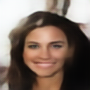

# Text-To-Image-From-Scratch

A full **training + inference pipeline** for generating images from text using a **conditional latent diffusion model**, built from scratch.

👉 **Try it live:** [Hugging Face Space — add link here]  
📖 **Read the full write-up:** [Medium article — add link here]

---

## Quick Start

1. Clone the repository  
2. Download the `models/` directory containing the trained weights  
   - You can find it here:  
     https://drive.google.com/drive/folders/1TI3GbpeOxqToHlBlmxEavMkZvVAvMu8j?usp=sharing
3. Install dependencies:
   ```bash
   pip install -r requirements.txt
   ```
4. Run live generation:
   ```bash
   python generate_live.py
   ```

---

## Overview

This is a **full training pipeline** for a conditional latent diffusion model implemented from scratch.

The model is trained on the **CelebA dataset**, using ~200,000 face images paired with captions generated from the dataset’s attribute columns.

The pipeline has three main stages:

---

## 1. Variational Autoencoder (VAE)

First, we train a **VAE** to encode images into a compact latent space.  
This allows the diffusion model to operate in latent space rather than pixel space, making training and sampling significantly more efficient.

---

## 2. CLIP (Text–Image Embeddings)

Next, we use a **transformer-based CLIP model** to process text–image pairs.

CLIP learns a **shared embedding space** by:
- Maximizing cosine similarity between matching text–image pairs
- Minimizing similarity for mismatched pairs

This gives us a clean way to condition image generation directly on text.

---

## 3. Conditional Diffusion (UNet)

Finally, we train a **conditional diffusion model** using a **UNet**.

The UNet learns to:
- Remove noise step-by-step
- Reconstruct the original image in latent space

Crucially, the diffusion process is **guided by CLIP embeddings**, allowing us to control generation using text prompts.

---

## Example Generations

Below are example outputs showing how the model responds to different prompts.  
It’s still imperfect, but the conditioning is clearly working.

**Prompt:** `"Smiling woman"`



---

**Prompt:** `"man"`


